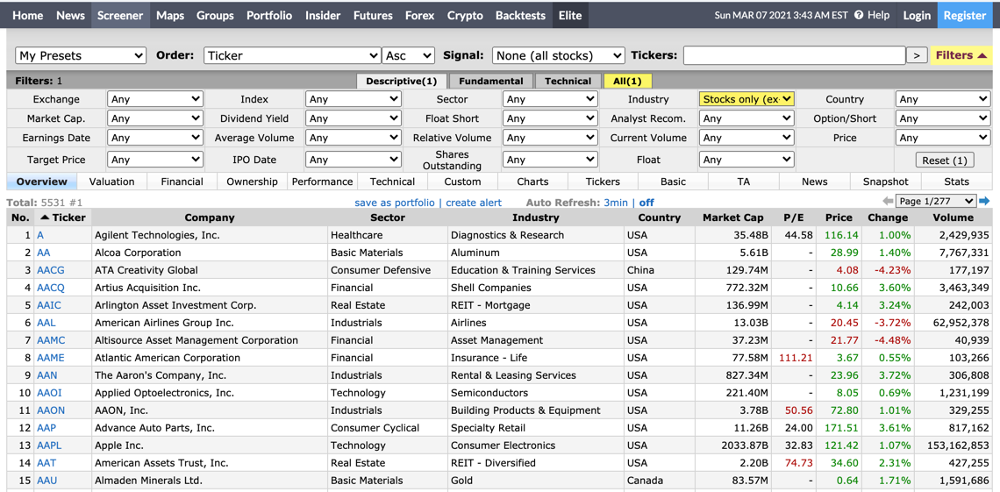
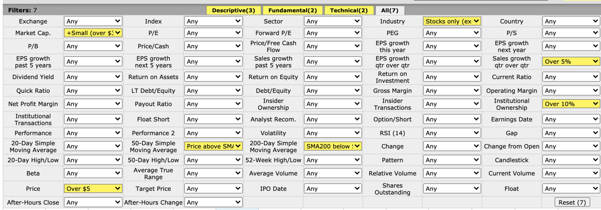
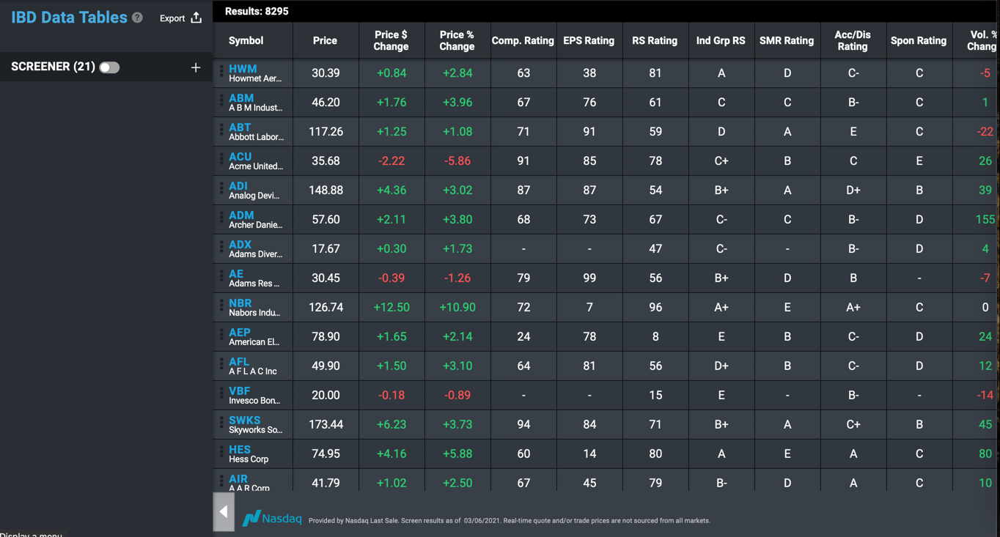

# Refining the buying process
## 0. Scrap the entire stocklists from Finviz (Run monthly)
#### Goal: Determine the sector and industry
#### Time: 6000/20*6 approximately 30 minutes required
Since I am only interested in stocks, the following link is used
https://finviz.com/screener.ashx?v=111&f=ind_stocksonly

## 1. Look for stocks satisfying the trend template, except RS (Weekly)
#### Time: Approximately 4 minutes required
#### Implement the trend template

According to Mark Minervini, "Think and Trade Like a Champion" Section 6 How and When to Buy Stocks - Part 1, we should only buy stocks "that are in long-term uptrends". 

Stocks have 4 stages:
####Stage 1: Neglect phase: consolidation
####Stage 2: Advancing phase: accumulation
####Stage 3: Topping phase: distribution
####Stage 4: Declining phase: capitulation

The following are the eight criteria a stock must meet to be considered in a confirmed Stage 2 uptrend. 

### Trend Template Criteria

Let's simplify the 8 criteria!

#### - Condition 1, 2, 4 and 8: `PX` > `50 MA` >`150 MA` > `200 MA`
#### - Condition 3: Slope of `200 MA` > 0
#### - Condition 5: `PX` >= 1.25(`52-week low`)
#### - Condition 6: `PX` >= 0.75(`52-week high`)
#### - Finviz High >= -25%
#### - (Not implemented in the scraping file)Condition 7: RS is greater than 70 (Will be in IBD)
Since the RS is proprietary, it will be found in the weekly downloaded IBD excel file
#### - Finviz Low >= 25%
### N.B. other conditions recommended by JLaw: sales growth qtr over qtr over 5% and institutional ownership over 10%
### Finviz condition: SMA50 < SMA200, 52W High >= -25%, 52W Low > 25%

https://finviz.com/screener.ashx?v=171&f=cap_smallover,fa_salesqoq_o5,ind_stocksonly,sh_instown_o10,sh_price_o5,ta_sma200_sb50,ta_sma50_pa&ft=4

## 3. Download IBD stock files weekly 
#### Goal: Filter the stocks that have RS > 70

## 4. Join the Trend_Template and the IBD
#### Goal: Join the Trend_Template and the IBD for the FULL TREND TEMPLATE with all 8 conditions